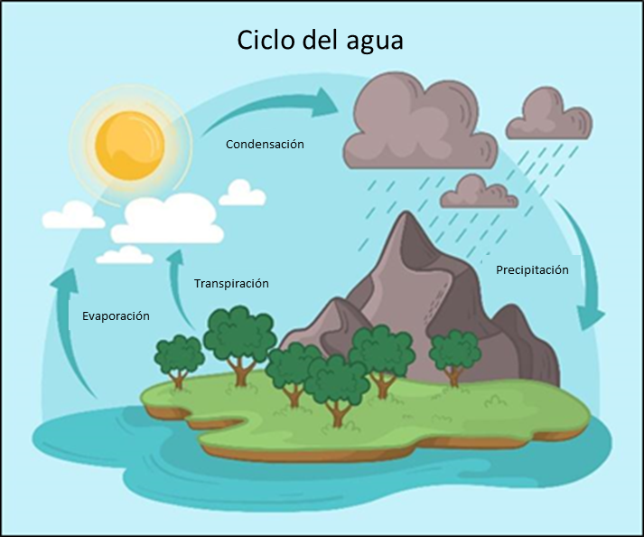
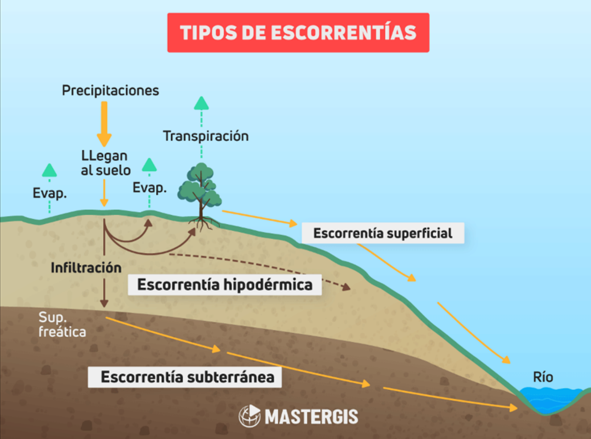

# Aguas de escorrentía {.unnumbered}

Para entender las aguas escorrentía, el primer paso es conocer el ciclo del agua: El agua en la Tierra, está en constante movimiento en los tres estados físicos, sólido, líquido y gaseoso. Esto se observa en los océanos, los ríos, las nubes y las lluvias, los cuales están sujetos a cambios frecuentes. Por ejemplo: el agua superficial se evapora, el agua presente en las nubes se precipita y la lluvia se infiltra en el suelo. Este proceso continuo y natural de circulación del agua, que comprende su desplazamiento desde las nubes hacia la tierra, los océanos y de vuelta a las nubes, se denomina ciclo del agua (@fig-ciclo-agua) (Carolina Vera & Inés Camilloni, 2023). Dentro del ciclo del agua ocurren 3 procesos químicos (NASA, 2023):

Evaporación: ocurre cuando el agua líquida se convierte en vapor de agua debido al calor o altas temperaturas. En este proceso el agua pasa desde la superficie terrestre hacia la atmósfera.

Condensación: ocurre cuando el agua líquida de la superficie de la Tierra, se transforma en vapor. Este vapor se enfría y condensa en gotas que permiten la formación de nubes.

Precipitación: se genera cuando las gotas que forman las nubes se tornan demasiado pesadas y caen en forma de lluvia, nieve o granizo. En este proceso se llenan los ríos, lagos, arroyos, entre otros, e inicia de nuevo el ciclo del agua con el proceso de evaporación.

{#fig-ciclo-agua}

**¿Sabías que****,**** en la tierra el agua puede seguir varios caminos?**

Cuando el agua lluvia cae a la superficie, parte de ella se infiltra en el suelo y se convierte en agua subterránea, y otra parte fluye superficialmente, se evapora o se desplaza hacia las corrientes fluviales, a este proceso se le denomina **escorrentía.**

## 2.1 ¿Qué es la escorrentía? {.unnumbered}

La escorrentía es un proceso físico que hace referencia al flujo de agua procedente de las precipitaciones o deshielo que circula sobre la superficie del suelo. Esto ocurre cuando la intensidad de la lluvia es mayor que la tasa de evaporación e infiltración del suelo o cuando el suelo está saturado (PNUD, 2022).

Este proceso del ciclo del agua es clave para el ser humano, ya que permite facilitar la gestión y almacenamiento de agua. Sin embargo, también puede generar efectos negativos. A continuación, se presentan algunas ventajas y desventajas de las aguas de escorrentía (@tbl-ventajas-desventajas):

| Ventajas | Desventajas |
| --- | --- |
| Transporte de nutrientes | Erosión del suelo |
| Generación de energía | Contaminación |
| Recarga de acuíferos | Inundaciones urbanas |
| Drenaje agrícola | Cambios en ecosistemas acuáticos |

: Ventajas y desventajas de las aguas de escorrentía {#tbl-ventajas-desventajas}

## 2.2 Tipos de escorrentía {.unnumbered}

Existen 3 tipos de escorrentía, superficial, hipodérmica y subterránea (@fig-tipos-escorrentia), a continuación, se define cada una de ellas, con base a los expuesto por Aquae Fundación (2022): 

**Superficial:**  flujo rápido de agua que no infiltra en la superficie del terreno y es impulsada por la fuerza de la gravedad hacía cauces fluviales. La escorrentía superficial se ve afectada por la acción humana, debido a que el flujo de esta agua transporta basuras, químicos y contaminantes que afectan la calidad del agua y del medio ambiente.

**Hipodérmica:** hace referencia al flujo de agua que se infiltra en el terreno y circula por el subsuelo a muy poca profundidad y corta distancia.

**Subterránea:** se produce cuando el agua se infiltra hasta alcanzar el nivel freático, tiene mayor profundidad y circula por las capas inferiores del suelo. Algunos factores que influyen en este tipo de escorrentía son: la humedad del suelo y su composición, la intensidad de la precipitación, las características geológicas, entre otros.

Este documento en específico, se centra en la gestión del riesgo por fenómenos generados debido a la **escorrentía superficial**.

{#fig-tipos-escorrentia}

