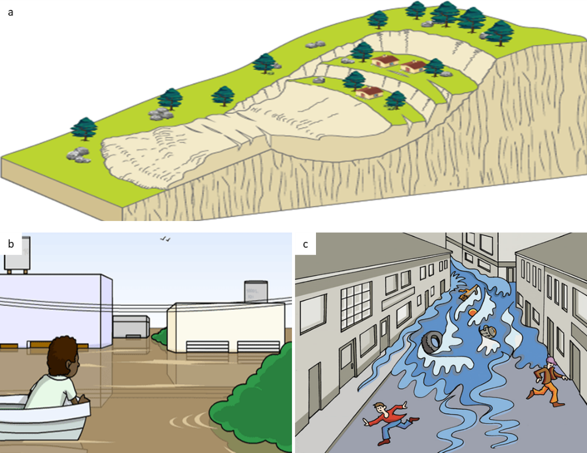
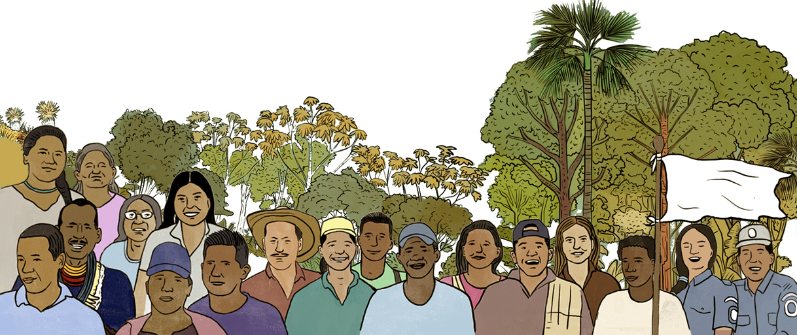

# Riesgos asociados y consecuencias

Los fenómenos naturales generados por el mal manejo de las aguas de escorrentía superficial pueden ser (@fig-fenomenos-naturales):

### 3.1 Inundaciones

Son aumentos de los niveles de agua producto de las lluvias intensas y variables, que incrementan los caudales en ríos y quebradas causando desbordamientos.

### 3.2 Movimientos en masa

Un movimiento en masa es el proceso por el cual un volumen de material constituido por roca, suelo, tierras, detritos o escombros, se desplaza ladera abajo por acción de la gravedad

### 3.3 Avenidas torrenciales

Las avenidas torrenciales son causadas por uno o varios factores, estos pueden ser precipitaciones intensas, sismos, enjambres de movimientos en masa, rotura de presas naturales o artificiales y grandes volúmenes de agua por deshielo

{#fig-fenomenos-naturales}

### 3.4 ¿Cuáles son los elementos expuestos frente a las inundaciones, movimientos en masa y avenidas torrenciales?

Los múltiples elementos, factores, recursos, bienes y servicios que debido a su localización pueden ser afectados cuando se manifiesta una amenaza por inundación, movimientos en masa y avenidas torrenciales son: 

**C****omunidades**** (@fig-comunidad-colombiana)****,**** viviendas,**** infraestructura,**** bienes muebles e inmuebles,**** servicios públicos,**** cultivos y terrenos.**

{#fig-comunidad-colombiana}

