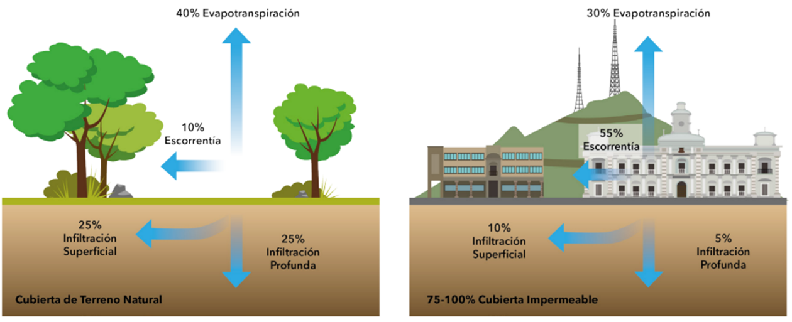

# Factores que agravan el problema {.unnumbered}

Las actividades humanas afectan las características de la superficie terrestre y la composición atmosférica de un territorio; incluyendo la modificación de la estructura del suelo, la reducción en la capacidad de almacenamiento de agua del mismo, el incremento en la escorrentía, la disminución en la diversidad de las especies, el incremento en las emisiones de aerosoles y otros gases, como consecuencia de las intervenciones antrópicas sin control (Reynolds y Stafford, 2002). 

• **Cambio de uso del suelo**** y el paisaje****:** 

La deforestación y la urbanización en zonas de riesgo afectan significativamente la gestión del agua y aumentan el impacto de la escorrentía. La reducción de la cobertura vegetal deja el suelo expuesto a la lluvia, el viento y la radiación solar, favoreciendo su erosión y disminuyendo su capacidad de absorción (figura 5) (Reynolds y Stafford, 2002).

La pérdida de áreas verdes y la creciente expansión urbana alteran el ciclo natural del agua, transformando las ciudades y territorios en zonas semidesérticas. Esto impide la recarga de acuíferos, esenciales para el abastecimiento de agua potable, y contribuye al efecto isla de calor, elevando las temperaturas en el interior de las ciudades, especialmente en verano (Castañeda et al., 2023). Estos cambios generan impactos negativos a nivel ambiental, económico y social, afectando la calidad de vida y el bienestar de la población. El crecimiento urbano sin planificación, la perdida de zonas de amortiguación natural en las ciudades y la construcción en zonas prohibidas, ocasiona un aumento en la probabilidad de la ocurrencia de fenómenos naturales relacionados con las aguas de escorrentía.

**Figura ****5****.** Comportamiento del agua de lluvia en dos contextos: natural y urbano. Fuente: tomado de IMPLAN Hermosillo (2017)

• **Infraestructura deficiente:** 

La falta de drenajes adecuados y la escasez de alcantarillado pluvial afectan significativamente la capacidad de las ciudades para gestionar el agua de escorrentía. La expansión urbana conlleva una creciente impermeabilización del suelo, lo que altera el ciclo hidrológico natural e incrementa el riesgo de inundaciones (Castañeda et al., 2023).

En muchas ciudades, la infraestructura pluvial es insuficiente debido al uso de diseños tradicionales que no responden a las necesidades actuales. Además, la acumulación de residuos sólidos en calles y vías bloquea los sistemas de drenaje, reduciendo aún más su eficacia. Como resultado, en las zonas más bajas de las ciudades, el agua de lluvia se acumula rápidamente, superando la capacidad de los sistemas de evacuación y generando inundaciones en períodos cortos de tiempo (Castañeda et al., 2023).

• **Cambios climáticos:** 

El aumento de la precipitación global debido al cambio climático, sumado a la urbanización y a la falta de infraestructura de drenaje adecuada, ha provocado que las ciudades en expansión de los países en desarrollo enfrenten inundaciones más frecuentes e intensas en comparación con décadas anteriores (Lovado, 2013).

En los próximos años, los efectos del cambio climático podrían agravar aún más esta problemática, con períodos más frecuentes de lluvias intensas. Esto no solo incrementaría el riesgo de inundaciones; sino que también favorecería la contaminación difusa, un fenómeno en el que el agua de lluvia, al impactar la superficie terrestre, disuelve y arrastra diversos contaminantes, tanto naturales como de origen humano (Castañeda et al., 2023).

