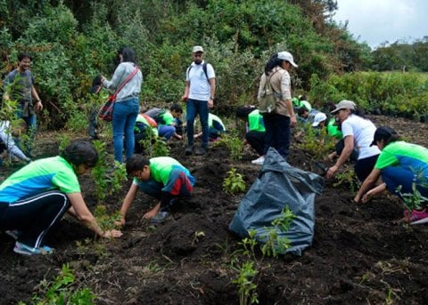
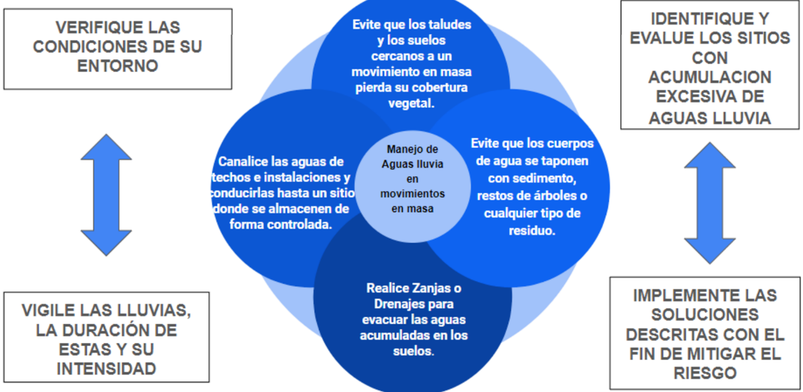
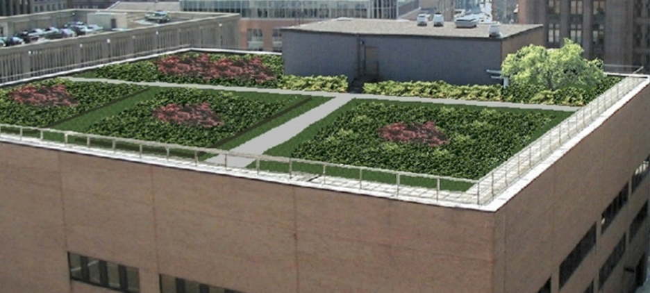
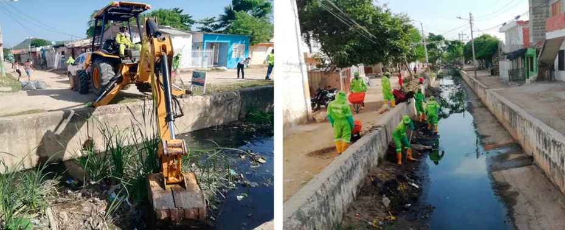
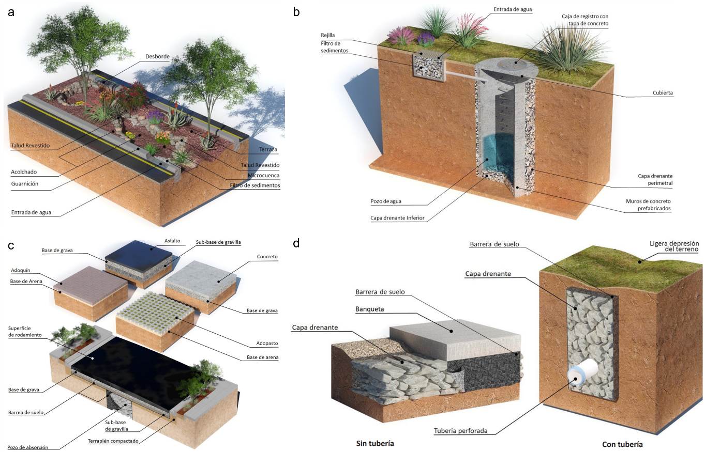
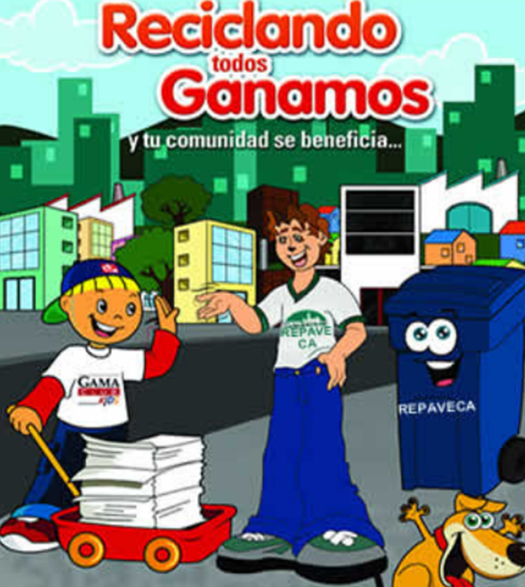
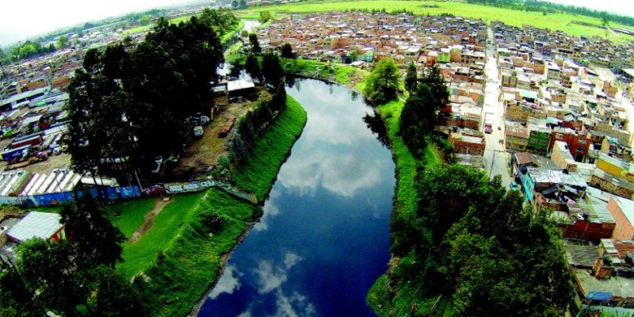
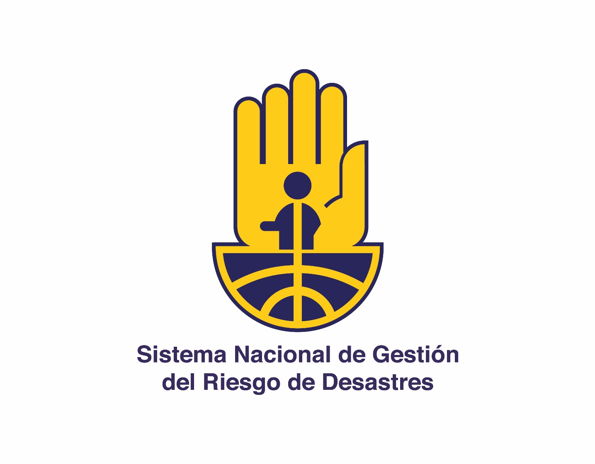

# Medidas de mitigación y buenas prácticas {.unnumbered}

Existen diversas maneras de prevenir el riesgo por fenómenos asociados a las aguas de escorrentía, estas incluyen acciones que pueden ser realizadas por la comunidad y acciones que pueden realizar las autoridades locales. A continuación, se enuncian algunas acciones y buenas prácticas que podrían mitigar este riesgo:

## 5.1 Acciones para la comunidad {.unnumbered}

**Manejo de residuos sólidos:** 

Un adecuado manejo de los residuos sólidos es clave para prevenir taponamientos en alcantarillas, desagües, sumideros y canales, permitiendo así un flujo eficiente del agua de escorrentía y reduciendo el riesgo de inundaciones. Para evitar obstrucciones y acumulación de desechos, se recomienda:

Realizar limpieza periódica de los sistemas de drenaje, tanto artificiales como naturales, para evitar represamientos.

Mantener en buen estado los canales de desagüe y alcantarillas, asegurando su correcto funcionamiento.

Promover la separación de residuos en origen y una adecuada disposición final, reduciendo la cantidad de desechos que pueden terminar en los sistemas de drenaje.

Participar en las campañas de sensibilización propuestas por las autoridades sobre la importancia de no arrojar basura en calles, ríos y alcantarillas.

**Aprovechamiento y manejo de aguas lluvias en viviendas:**

El manejo adecuado del agua de lluvia en los hogares ayuda a reducir el impacto de la escorrentía, previniendo inundaciones y permitiendo un mejor uso de este recurso. Para ello, se recomienda:

Canalizar el agua de los techos hacia zonas de drenaje cercanas o jardines permeables, evitando que fluya sin control y cause erosión o acumulaciones innecesarias.

Implementar sistemas de captación de aguas lluvias, como tanques de almacenamiento o barriles pluviales, que permiten reutilizar el agua para riego, limpieza y otros usos domésticos.

Promover la infiltración del agua en el suelo mediante superficies permeables, jardines de lluvia o pozos de absorción, favoreciendo la absorción de agua en el suelo.

**Reforestación y protección de zonas verdes: **

El mantenimiento y recuperación de áreas verdes es una estrategia fundamental para reducir la velocidad y cantidad del agua de escorrentía, minimizando su impacto sobre el suelo y la infraestructura. Algunas acciones que se pueden realizar son:

Instalación de vegetación adecuada en las zonas erosionables y sus alrededores, lo que ayuda a disminuir la cantidad de agua de escorrentía y su energía [@roman2014].

Control de erosión mediante la siembra de vegetación en pendientes pronunciadas, la construcción de zanjas en laderas y la instalación de barreras de contención o barreras vegetativas. Estas medidas estabilizan el suelo y reducen la erosión causada por el flujo descontrolado de agua [@gonzalez2009; @salazar2010].

Reforestación (@fig-reforestacion) y construcción de cercas vivas para evitar la pérdida de cobertura vegetal y fortalecer la capacidad natural del suelo para absorber el agua.

{#fig-reforestacion}

**Cuidado de cuerpos de agua:** 

La protección de ríos, quebradas, humedales y otros cuerpos de agua es fundamental para reducir el riesgo de desbordamientos, mejorar la calidad del agua y preservar los ecosistemas. Para ello, se recomienda:

Evitar la invasión de rondas hídricas, respetando las franjas de protección alrededor de ríos y quebradas, lo que permite que estas zonas actúen como áreas de amortiguación frente a inundaciones.

Realizar limpiezas periódicas para evitar la acumulación de residuos sólidos y sedimentos que puedan obstruir el flujo del agua.

Promover la restauración ecológica mediante la reforestación y conservación de la vegetación ribereña, lo que ayuda a estabilizar el suelo y reducir la erosión.

**Mitigación de riesgos agroclimáticos:** 

Las buenas prácticas agrícolas son esenciales para reducir los riesgos agroclimáticos en los cultivos (@fig-manejo-suelos-cafeteras), ya que permiten un mejor aprovechamiento de las condiciones del suelo y minimizan la pérdida de cobertura vegetal. Estas medidas son fáciles de interpretar e implementar y ayudan a mitigar el impacto de las lluvias intensas y prolongadas.

La planificación agrícola es clave para evitar la degradación del suelo y optimizar los recursos disponibles. Para ello, es fundamental evaluar las condiciones climáticas locales y considerar estrategias que equilibren la producción con la sostenibilidad ambiental. Las medidas de mitigación se pueden resumir en la siguiente ecuación:

**✅**** Buenas Prácticas = Diagnóstico de las condiciones + Medidas Implementadas**

Bajo este enfoque medioambiental, comercial y social; se recomienda:

Construir zanjas o sistemas de drenaje para evacuar el exceso de agua acumulada en el suelo y reducir el riesgo de erosión.

Alternar los tipos de cultivos para evitar el agotamiento del suelo y mejorar su fertilidad.

Implementar un sistema de riego eficiente, reduciendo el consumo de agua y evitando la formación de escorrentía excesiva.

Rotar las zonas de tránsito de maquinaria en cada ciclo de siembra para minimizar la compactación del suelo.

Realizar siembras perpendiculares a la pendiente del terreno, adaptándose al tipo de cultivo y la época del año para reducir la erosión y optimizar la absorción del agua.

{#fig-manejo-suelos-cafeteras}

## 5.2 Acciones para autoridades locales {.unnumbered}

Para el manejo de aguas lluvia de escorrentía en zonas urbanas se recomienda a las autoridades territoriales la realización de las siguientes actividades:

•** Planificación territorial:** 

Una adecuada planificación territorial es fundamental para reducir los riesgos asociados a la escorrentía y las inundaciones. Para ello, las autoridades locales deben:

Identificar y delimitar zonas de riesgo, asegurando que no se permitan construcciones en áreas inundables o de alta susceptibilidad a la escorrentía.

Fortalecer la gestión del ordenamiento territorial, incorporando criterios de sostenibilidad hídrica en los planes de desarrollo urbano y rural.

Establecer normativas y mecanismos de control, garantizando que las nuevas construcciones cumplan con estándares de seguridad y resiliencia ante eventos climáticos extremos.

Promover soluciones basadas en la naturaleza, como la conservación de humedales y zonas de amortiguamiento, que ayuden a regular el flujo del agua y reduzcan el impacto de las lluvias intensas.

El fortalecimiento del ordenamiento territorial en torno al agua es clave para disminuir los escenarios de riesgo por inundación y garantizar un desarrollo urbano y rural más seguro y sostenible.

• **Infraestructura de drenaje:** 

El diseño, construcción y mantenimiento de infraestructura de drenaje es esencial para la correcta gestión del agua de escorrentía y la reducción del riesgo de inundaciones. Para ello, las autoridades locales deben:

Construir y mantener canales, alcantarillados y obras de control de aguas lluvias, asegurando su correcto funcionamiento y capacidad de evacuación.

Diseñar canales multifuncionales, que no solo transporten el agua, sino que también permitan su retención y, cuando sea posible, favorezcan la infiltración.

Instalar cubiertas verdes en edificaciones (@fig-techos-verdes), promoviendo la retención y absorción de agua de lluvia, además de contribuir a la regulación térmica y la mejora ambiental en entornos urbanos [@lovado2013].

Implementar planes de mantenimiento y dragado (@fig-dragado-canales), evitando el taponamiento y la obstrucción de canales y sistemas de drenaje [@gonzalez2009; @lovado2013].

{#fig-techos-verdes}

{#fig-dragado-canales}

En cuanto al fomento de la infiltración y absorción del suelo. Para reducir la escorrentía superficial y mejorar la recarga de acuíferos, se recomienda:

Construir zanjas de infiltración y pavimentos permeables, permitiendo que el agua de lluvia se absorba naturalmente en el suelo.

Conservar y ampliar áreas verdes como parques y jardines, que favorecen la retención y filtración del agua [@gonzalez2009; @salazar2010].

Una alternativa eficiente de infraestructura son los sistemas Urbanos de Drenaje Sostenible (SUDS) (@fig-suds). La implementación de Sistemas Urbanos de Drenaje Sostenible (SUDS) es una estrategia innovadora que permite controlar la cantidad y calidad de la escorrentía mediante procesos de sedimentación, filtración, biodegradación y absorción por plantas [@chen2021]. Estos sistemas buscan:

Reducir el volumen del agua vertida a los sistemas de drenaje tradicionales.

Mejorar la calidad del agua que llega a los cuerpos naturales.

Integrar la gestión del agua de lluvia con la protección del medioambiente [@valdivielso2017].

Algunos ejemplos de SUDS incluyen:

Jardines de lluvia y microcuencas para captar y filtrar el agua.

Pozos de infiltración y zanjas filtrantes para aumentar la absorción del agua en el suelo.

Humedales y estanques de detención multifuncionales, que retienen y depuran el agua antes de su liberación.

Pavimentos permeables y techos verdes, que reducen el escurrimiento y mejoran la eficiencia del drenaje urbano.

Muros verdes y alcorques inundables, que contribuyen a la captación y aprovechamiento del agua pluvial [@minvivienda2022].

El desarrollo de infraestructura de drenaje resiliente y sostenible es clave para reducir el impacto de las lluvias intensas y mejorar la adaptación al cambio climático en las ciudades.

{#fig-suds}

**• Educación y participación comunitaria:** 

La sensibilización y capacitación de la comunidad son esenciales para la gestión del riesgo por aguas de escorrentía. Para ello, se recomienda:

Capacitar a líderes locales, brindándoles herramientas para que promuevan buenas prácticas en sus comunidades y fortalezcan la resiliencia frente a eventos climáticos extremos.

Realizar campañas de sensibilización (@fig-campana-educativa) dirigidas a la población en general sobre la importancia del manejo adecuado de residuos y el impacto negativo de su mala disposición en el sistema de drenaje urbano.

Fomentar planes comunitarios de reciclaje, promoviendo la reducción de desechos y la reutilización de materiales, lo que contribuye a disminuir la acumulación de residuos en alcantarillas y drenajes.

Organizar jornadas comunitarias de limpieza y recolección de basuras, evitando la obstrucción de los sistemas de alcantarillado y reduciendo el riesgo de inundaciones.

El compromiso activo de la comunidad, junto con el apoyo de las autoridades locales, es clave para construir ciudades más sostenibles y resilientes frente a los efectos de la escorrentía y las lluvias intensas.

{#fig-campana-educativa}

**• Normativa y fiscalización:** 

El cumplimiento y aplicación de la normativa ambiental y urbanística es fundamental para la gestión del riesgo por aguas de escorrentía. Para ello, las autoridades locales deben:

Hacer cumplir las reglamentaciones vigentes a través de las oficinas de planeación, medio ambiente e infraestructura, garantizando el uso adecuado del territorio.

Proteger las fuentes hídricas, manteniendo franjas de vegetación densa en sus riberas (@fig-proteccion-rio-bogota) para reducir la erosión y mejorar la infiltración del agua.

Respetar y delimitar las rondas hídricas, de acuerdo con lo establecido por la Corporación Autónoma Regional y el Decreto 2245 de 2017. En caso de no contar con una delimitación oficial, se debe gestionar su definición.

Identificar escenarios de riesgo asociados a la escorrentía, como inundaciones, movimientos en masa y avenidas torrenciales, con el fin de incluirlos en los instrumentos de gestión del riesgo del territorio.

Integrar estos escenarios en los planes y estrategias municipales, como el Plan Municipal de Gestión del Riesgo y la Estrategia Municipal de Respuesta a Emergencias, en cumplimiento de la Ley 1523 de 2012, garantizando una articulación efectiva entre instituciones y comunidades para reducir el impacto sobre la población y la infraestructura.

{#fig-proteccion-rio-bogota}

**• Sistemas de alerta temprana:** 

En los puntos en donde se han detonado movimientos en masa, inundaciones y avenidas torrenciales, se recomienda la instalación de sistemas de alertas tempranas que incluyan el monitoreo de aguas lluvia y de los niveles de agua de los ríos.

**• Planes de emergencia:** 

Es deber de las entidades territoriales la inclusión de los escenarios de riesgo por aguas de escorrentía en los instrumentos de gestión del riesgo, tales como los Planes Municipales de Gestión del Riesgo y las Estrategias de Respuesta a Emergencias. Estos deben tenerse en cuenta para el establecimiento de rutas de evacuación y los protocolos de acción para lluvias intensas.

**• Coordinación interinstitucional:**

Para lograr una efectiva gestión del riesgo desde lo local, se debe contar con un trabajo conjunto entre entidades, que cuente con el apoyo de las autoridades departamentales y las Corporaciones Autónomas Regionales, que hacen parte del Sistema Nacional de Gestión del Riesgo de Desastres – SNGRD (@fig-sngrd) y responden por los procesos de la gestión del riesgo en su jurisdicción.

{#fig-sngrd}

